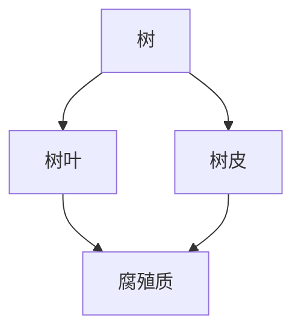
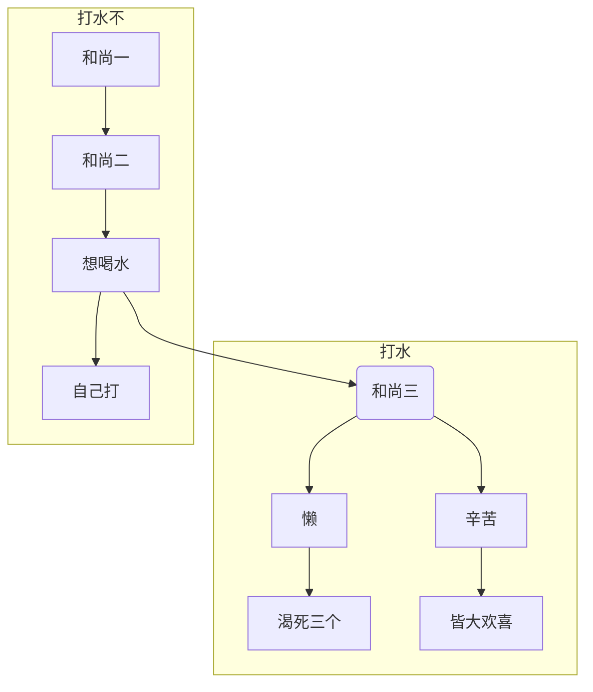

生是打工人 :construction_worker: ，死是打工魂 :skull: 


- [- 我红了 -] 
- {+ 我绿了 +} 

`我灰了`


下面要说两件事

[[_TOC_]]

## 第一件事

有四大点

1. [x] ddl1
2. [ ] ddl2
   1. [x] ddl2.1
   2. [ ] ddl2.2
3. [x] 还是 ddl
4. [ ] 最后一个 ddl

## 第二件事

有两大点

- [x] ddl1
- [ ] ddl2
  - [x] ddl2.1
  - [ ] ddl2.2


> 一个长句

break

> 又一个长句


>>>
四

个

短

句
>>>


```
嚯
```
    哈
~~~
诶
~~~


*比萨斜塔*

_是斜的_

**加粗要四个星**

__或者四个下划线__

**_加粗的比萨斜塔_**

~~别说了~~

一句话中有 *比萨斜塔* 是这样的

# 一级
## 二级
### 三级
#### 四级
##### 五级
###### 六级

分割线
---

<p>
<details>
<summary>点击查看更多</summary>

有一个 <em>比萨斜塔</em> 没有<strong>加粗</strong>

<pre><code>changelog</code></pre>

</details>
</p>


- [- doing... -]
